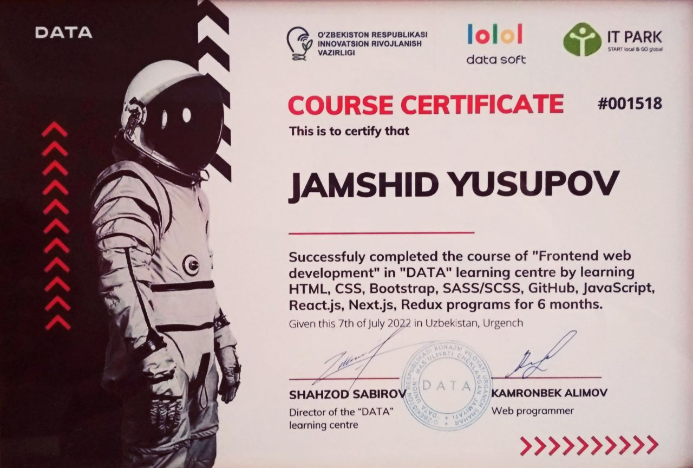
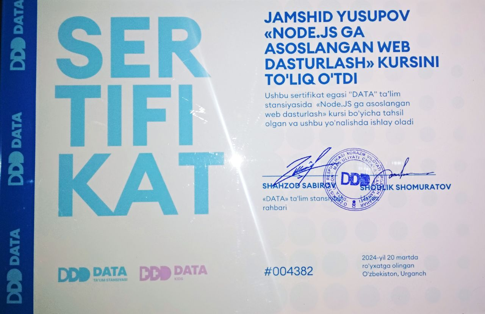

<b>
✩ I started my journey as a Frontend developer when I saw a video about programming on Youtube💻. And then I was carried into this interesting and unexplored world🌎. After Frontend, I decided to learn Backend, too. Now, I'm happy to help you develop something interesting😊 ✩
</b>

 

<h1 align="center">Github Statistics 📊</h1>

  

<h1 align="center">Certificates 📊</h1>

<figure>

<table>

<tr>

  <td>
  

  <figcaption align="center">
  <b>Frontend certificate</b>
  </figcaption>

  </figure>

  </td>

  <td>
  <figure>
  

  <figcaption align="center">
  <b>Backend certificate</b>
  </figcaption>

  </figure>
  </td>
</tr>

</table>

  

<h1 align="center">Technologies ⚙️</h1>

  

<h1 align="center">Codewars Profile ⌨</h1>

<b>
If would like to <a href="https://www.codewars.com/users/Jamshudanamana" target="_blank">see more</a>, welcome!
</b>

  

<h1 align="center">Contact Me 📞</h1>

